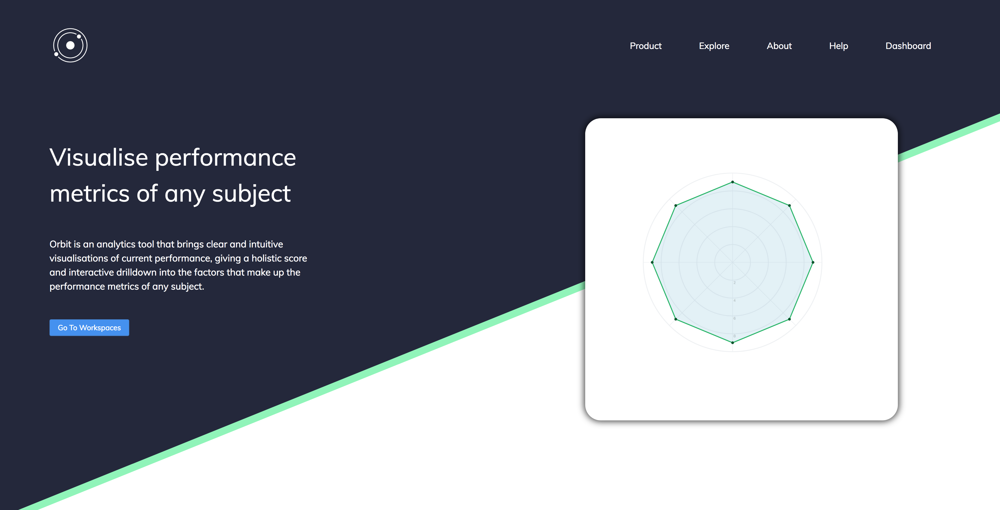
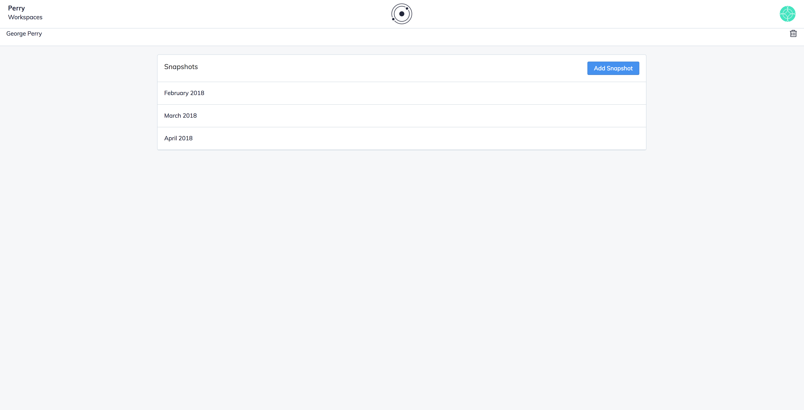
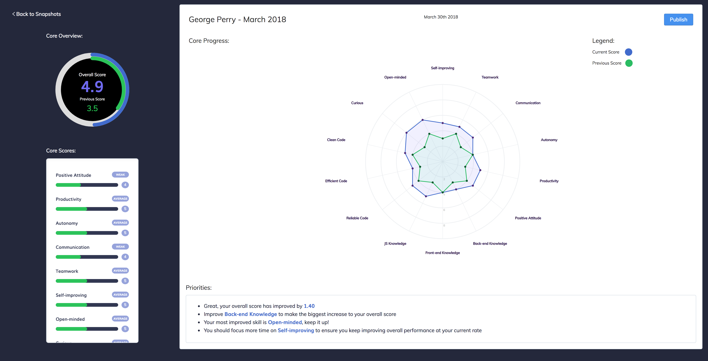
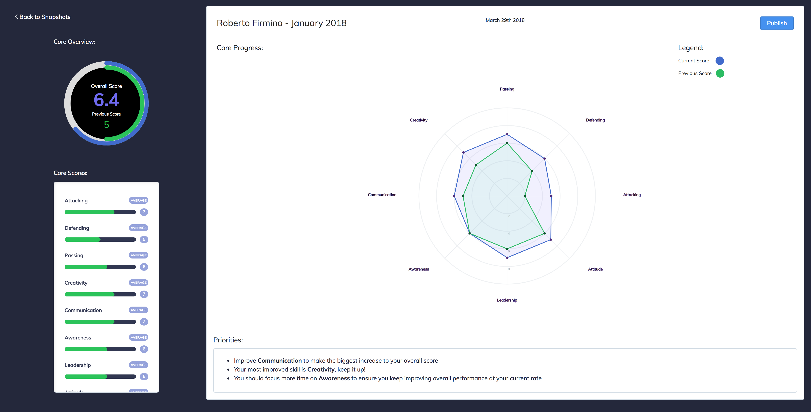

 </img>

# Orbit

## What is Orbit?
Orbit is an open-source data visualisation tool that allows businesses, sports teams and educational institutions track, measure and improve performance. Built using cutting-edge technologies, Orbit provides a birds-eye-view on performance metrics in a way that is easy to understand and digest. Students, players and employees are presented with key changes they can make to improve the performance through a complex neural networks, helping users focus their time more effectively and efficiently.

## Tech Stack:

### Front-end:
* React
* Redux
* Webpack
* D3.js
* VX.js
* PostCSS

### Back-end: [Orbit-server](https://github.com/cjjenkinson/orbit-server)
* Koa
* MongoDB
* MongoLab
* Travis CI
* Heroku

## Screenshots:

    </img>
  

  

   </img>
  

  

    </img>
  

  

    </img>
  

  

    </img>
  

